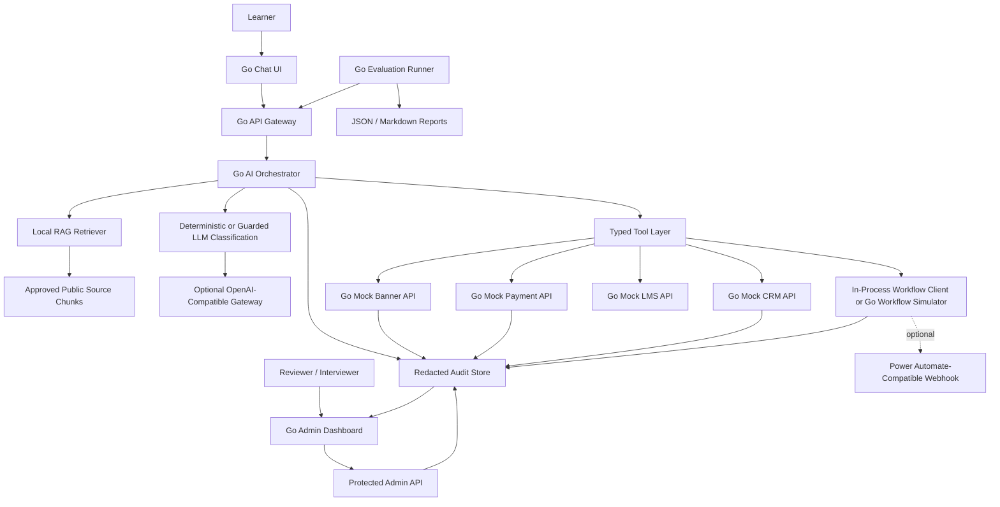
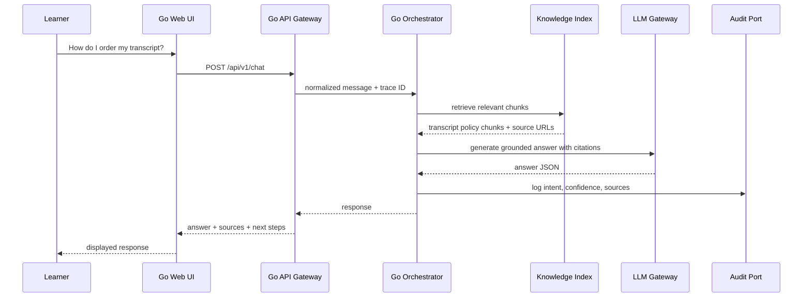
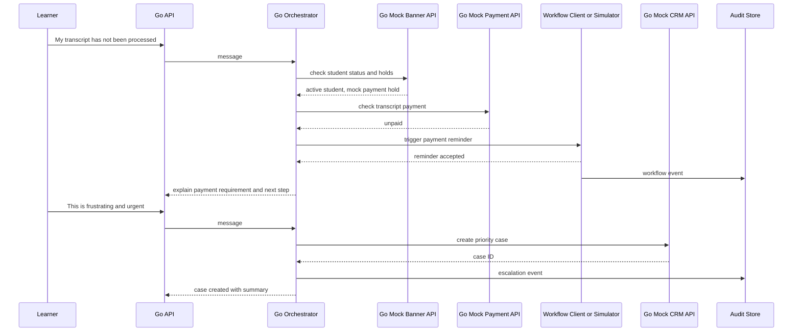
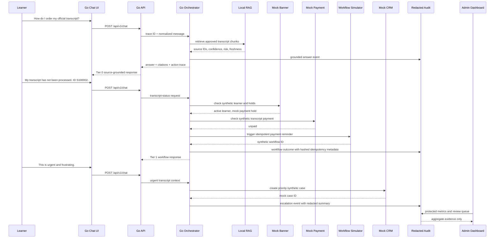

# Architecture

## Purpose

This document describes the proposed Go-based architecture for the AskOC AI Concierge MVP. The goal is to demonstrate how an AI/automation developer can design, build, deploy, and maintain a learner-service automation solution that supports instant answers, real-time decisioning, workflow automation, and escalation.

## Design principles

1. **Grounded by default**: The assistant should answer policy and procedure questions only from approved sources.
2. **Go-first services**: Core API, orchestration, mock integrations, ingestion, workflow simulation, and evaluation should be implemented in Go.
3. **Transaction-aware**: The assistant should not only answer questions; it should initiate safe, auditable workflows.
4. **Human handoff when needed**: Low-confidence, sensitive, or frustrated interactions should route to staff.
5. **Privacy by design**: Use synthetic data in the demo and avoid exposing unnecessary personal information.
6. **Observable and measurable**: Every answer, retrieval, tool call, escalation, and workflow should be logged.
7. **Composable architecture**: AI, APIs, automation, and dashboard components should be replaceable.

## High-level architecture



P11 diagram review: the portfolio diagram explicitly includes the chat UI, Go API, orchestrator, RAG, mock Banner/payment/CRM/LMS services, workflow boundary, audit store, dashboard, optional LLM gateway, and evaluation reports. Every component exists as a Go command, Go package, local fixture, Markdown contract, or generated report in the repository.

## Core services

| Service | Go package/command | Responsibility |
|---|---|---|
| Public API | `cmd/api` | Serves chat UI, REST API, provider wiring, local retrieval wiring, workflow client selection, and chat orchestration |
| Orchestrator | `internal/orchestrator` | Coordinates guarded classification, prompt templates, local RAG source packaging, tools, workflow, and escalation ports |
| RAG ingestor | `cmd/ingest` + `internal/rag` | Fetches approved public pages, cleans HTML, chunks content, and writes local JSON chunks |
| LLM gateway | `internal/llm` | P6 provider-neutral types and tested Azure OpenAI/OpenAI-compatible REST calls |
| Classifier | `internal/classifier` | P6 deterministic fallback, strict JSON parser, and fixture-backed intent/sentiment checks |
| Tool clients | `internal/tools` | Typed clients for Banner, payment, CRM, and LMS |
| Privacy | `internal/privacy` | Shared redaction for logs, sessions, audit payloads, and CRM summaries |
| Audit | `internal/audit` | Redacted in-memory event store, dashboard summaries, export, reset, purge, and workflow metrics |
| Workflow | `internal/workflow` | In-process idempotent client, local simulator handler, idempotency hashing, and optional Power Automate-compatible webhook client |
| Mock Banner | `cmd/mock-banner` | Synthetic student records and holds |
| Mock payment | `cmd/mock-payment` | Synthetic transcript payment status |
| Mock CRM | `cmd/mock-crm` | Case creation and queue routing |
| Mock LMS | `cmd/mock-lms` | LMS account/course access simulation |
| Workflow simulator | `cmd/workflow-sim` | Local Power Automate-style payment reminder endpoint plus protected workflow metrics/export |
| Evaluation | `cmd/eval` + `internal/eval` | Runs the JSONL test set against deterministic in-process fakes or a local chat API, scores quality, writes reports, and fails critical gates |
| Local packaging | `Dockerfile` + `docker-compose.yml` | Builds API/mock-service images and starts the synthetic local demo stack with deterministic defaults |
| Developer checks | `scripts/smoke.sh` + `scripts/check-secrets.sh` | Verifies `/healthz`, transcript workflow, CRM handoff, and secret-safe repo inputs |

## Recommended Go project layout

```text
cmd/
  api/
  mock-banner/
  mock-payment/
  mock-crm/
  mock-lms/
  workflow-sim/
  ingest/
  eval/
internal/
  audit/
  classifier/
  config/
  domain/
  handlers/
  llm/
  middleware/
  orchestrator/
  privacy/
  rag/
  tools/
  workflow/
web/
  templates/
  static/
data/
  seed-sources.json
  rag-chunks.json
  synthetic-students.json
  eval-questions.jsonl
reports/
  eval-summary.json
  eval-summary.md
```

## Core domain models

```go
type Intent string

const (
    IntentTranscriptRequest Intent = "transcript_request"
    IntentTranscriptStatus  Intent = "transcript_status"
    IntentFeePayment       Intent = "fee_payment"
    IntentHumanHandoff     Intent = "human_handoff"
    IntentUnknown          Intent = "unknown"
)

type ChatRequest struct {
    ConversationID string `json:"conversation_id,omitempty"`
    Channel        string `json:"channel"`
    Message        string `json:"message"`
    StudentID      string `json:"student_id,omitempty"`
}

type ChatResponse struct {
    ConversationID string       `json:"conversation_id"`
    TraceID        string       `json:"trace_id"`
    Answer         string       `json:"answer"`
    Intent         IntentResult `json:"intent"`
    Sentiment      Sentiment    `json:"sentiment"`
    Sources        []Source     `json:"sources"`
    Actions        []Action     `json:"actions"`
    Escalation     *Escalation  `json:"escalation,omitempty"`
}
```

P6 uses these models in `internal/domain` with provider-neutral request/response structs, source citations, source confidence/risk/freshness metadata, learner-safe action traces, idempotency key metadata, and handoff metadata. Request validation lives in `internal/validation`; the guarded orchestrator lives in `internal/orchestrator`.

## Component responsibilities

### 1. Go learner chat UI

The UI can be implemented as simple server-rendered Go templates for a fast portfolio build.

P2 serves the first implementation from Go templates at `/chat`, with static assets under `/static/` and API calls to `/api/v1/chat`.

Recommended capabilities:

- message history,
- source display,
- confidence indicator,
- escalation status,
- optional transcript download,
- accessibility-friendly layout.

Optional alternative: React/Next.js frontend calling the Go API.

### 2. Go API gateway

The API gateway receives requests, validates input, applies rate limits, and forwards messages to the orchestrator.

Responsibilities:

- validate JSON payloads,
- generate trace IDs,
- enforce mock bearer token,
- sanitize user input,
- return structured assistant responses,
- log interaction metadata,
- expose health checks and dashboard metrics.

### 3. Go AI orchestrator

The P6 orchestrator coordinates source-grounded transcript answers, optional guarded LLM classification/answering, and the deterministic transcript/payment interaction. Live provider use is opt-in through `ASKOC_PROVIDER=openai-compatible`; local deterministic behavior remains the default.

Responsibilities:

- classify intent,
- classify sentiment and urgency,
- retrieve approved local source chunks for transcript-request answers,
- return safe fallback or staff-confirmation wording for low-confidence, stale, or high-risk source matches,
- call mock enterprise APIs,
- generate deterministic responses,
- trigger the in-process P4 workflow port,
- decide when to escalate,
- record workflow audit-port events.

Recommended orchestrator interface:

```go
type Orchestrator interface {
    HandleChat(ctx context.Context, req ChatRequest) (ChatResponse, error)
}
```

### 4. Knowledge index

The knowledge index stores chunks from approved public pages. Each chunk should include:

- source URL,
- source title,
- chunk ID,
- content hash,
- last indexed date,
- retrieval confidence,
- risk level,
- freshness status,
- embedding vector or search key,
- access level,
- effective date if known.

### 5. Mock enterprise APIs

The MVP uses Go services to simulate enterprise integrations.

| Service | Purpose |
|---|---|
| Mock Banner API | Student profile, program, holds, transcript eligibility |
| Mock Payment API | Transcript fee payment status and confirmation |
| Mock CRM API | Case creation, queue routing, case status |
| Mock LMS API | LMS account or course-access status |

### 6. Automation workflow

The automation layer represents either the local Go workflow simulator, the in-process fallback client, or Power Automate through the same webhook-compatible interface.

Example workflow:

```text
CRM case created
→ classify queue
→ assign priority
→ notify learner
→ notify service team
→ update case status
→ write audit event
```

For local demos, `cmd/workflow-sim` exposes an HTTP endpoint that behaves like a Power Automate cloud flow.

### 7. Admin dashboard

The dashboard helps staff monitor adoption, performance, and risk.

Recommended views:

- total conversations,
- containment rate,
- escalation rate,
- top intents,
- unresolved questions,
- low-confidence responses,
- sentiment distribution,
- average response time,
- automation success/failure,
- retraining queue.

## Request flow: grounded answer



## Request flow: transcript status automation



## P11 interview sequence



The interview sequence traces the 5-7 minute walkthrough: Tier 0 grounded answer, Tier 1 transcript/payment workflow, urgent escalation, redacted dashboard evidence, and no real learner-system dependency.

## Data stores

### Conversation table

| Field | Type | Notes |
|---|---|---|
| `conversation_id` | UUID/text | Primary identifier |
| `created_at` | timestamp | UTC |
| `channel` | string | Web, Teams, voice, etc. |
| `synthetic_student_id` | string/null | Demo only |
| `intent` | string | Latest predicted intent |
| `sentiment` | string | neutral, positive, negative, urgent |
| `status` | string | open, resolved, escalated |

### Message table

| Field | Type | Notes |
|---|---|---|
| `message_id` | UUID/text | Primary identifier |
| `conversation_id` | UUID/text | Foreign key |
| `role` | string | learner, assistant, system |
| `content_redacted` | text | Redacted content only |
| `created_at` | timestamp | UTC |

### Retrieval event table

| Field | Type | Notes |
|---|---|---|
| `trace_id` | string | Request trace |
| `query` | text | Redacted query |
| `source_ids` | JSON | Retrieved source IDs |
| `top_score` | float | Retrieval confidence |
| `created_at` | timestamp | UTC |

### Tool call table

| Field | Type | Notes |
|---|---|---|
| `trace_id` | string | Request trace |
| `tool_name` | string | banner, payment, crm, workflow |
| `request_summary` | JSON | No secrets or sensitive raw values |
| `response_summary` | JSON | Minimal result summary |
| `duration_ms` | integer | Tool latency |
| `status` | string | success, failed, timeout |

## API ports for local demo

| Service | Port |
|---|---:|
| `cmd/api` | 8080 |
| `cmd/mock-banner` | 8081 |
| `cmd/mock-payment` | 8082 |
| `cmd/mock-crm` | 8083 |
| `cmd/workflow-sim` | 8084 |
| `cmd/mock-lms` | 8085 |
| PostgreSQL | 5432 |

## Deployment options

### Local demo

```text
Docker Compose
- api
- mock-banner
- mock-payment
- mock-crm
- mock-lms
- workflow-sim
```

The local Compose stack uses `ASKOC_PROVIDER=stub`, synthetic fixtures, service-DNS URLs for mock integrations, and `workflow-sim` for payment reminder automation. Host ports default to `8080`-`8085` and can be overridden with `ASKOC_API_PORT`, `ASKOC_BANNER_PORT`, `ASKOC_PAYMENT_PORT`, `ASKOC_CRM_PORT`, `ASKOC_WORKFLOW_PORT`, and `ASKOC_LMS_PORT`. PostgreSQL remains a later deployment option; the P11 portfolio demo stack is fully deterministic without a database.

```bash
make smoke
make compose-up
make compose-test
```

### Cloud path

```text
Azure Container Apps or Kubernetes
Azure OpenAI or equivalent LLM service
Azure AI Search or managed vector search
Azure Key Vault for secrets
PostgreSQL or managed database
Power Automate for workflow automation
```

## Risk controls

| Risk | Control |
|---|---|
| Hallucinated policy answer | Require source-grounded generation and confidence threshold |
| Stale deadline or fee information | Show source/indexed date and escalate stale content |
| Prompt injection | System instruction isolation, retrieved-content treatment, allowlisted tools |
| Privacy leak | Redaction before logging, synthetic records only, minimal CRM summaries |
| Tool misuse | Typed tool inputs, allowlisted actions, audit logging |
| Duplicate reminders | Idempotency key per trace/student/action plus hashed idempotency metadata in audit events |
| Workflow outage | Retry transient webhook failures within the configured limit, log safe failure, create CRM case if needed |
